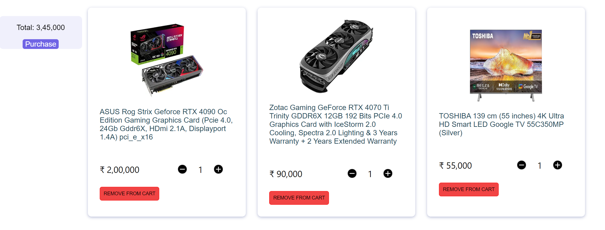
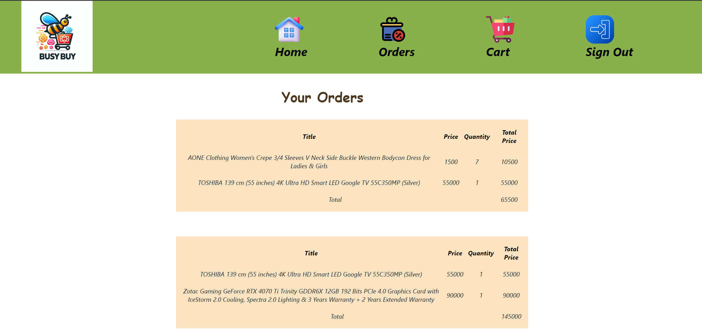

# BusyBuy-1 - 🛒 🛍️ 💻
## ⭐ Introduction 

This is BusyBuy-1 web app which is build using ReactJS🚀

Deployed using Render -: https://main--busybuy-1.netlify.app/

## Screenshots
HomePage-:

Products-:

Cart-:

Orders-:

## Features

- Introduction to the E-commerce Website:
E-commerce website, built using ReactJS, offers users a modern and intuitive platform for online shopping. With a focus on user experience and functionality, this website aims to provide customers with a seamless shopping experience from start to finish. 

- User Experience and Navigation:
Upon landing on the homepage, users are greeted with a visually appealing interface designed to captivate their attention and encourage exploration. Leveraging the power of React Router DOM, navigation between pages is smooth and instantaneous, ensuring that users can effortlessly browse through various sections of the website.

- Features and Functionality:
Website boasts a plethora of features designed to enhance the shopping experience. Users can easily sign up for an account to access personalized features and preferences. Once logged in, they are presented with a curated selection of products, which they can further explore and filter based on price range and category. The use of React spinner libraries ensures that users are kept informed of loading processes, minimizing frustration and enhancing user satisfaction.

- Shopping Cart and Checkout Process:
Adding items to the cart is a breeze, thanks to our intuitive interface and seamless integration of shopping cart functionality. Users can review their selected items, adjust quantities as needed, and view the total amount before proceeding to checkout. Our checkout process is straightforward, offering users a hassle-free experience as they finalize their purchases and proceed to the Orders page.

- Orders and Confirmation:
The Orders page serves as a centralized hub where users can track and manage their purchases. Upon completing their order, users are promptly redirected to this page, where they can view detailed order summaries, including product details, quantities, and total amounts. This transparent and informative approach instills confidence in users, ensuring that they feel secure and informed throughout the entire shopping process.

## 🔨 Tools Used

